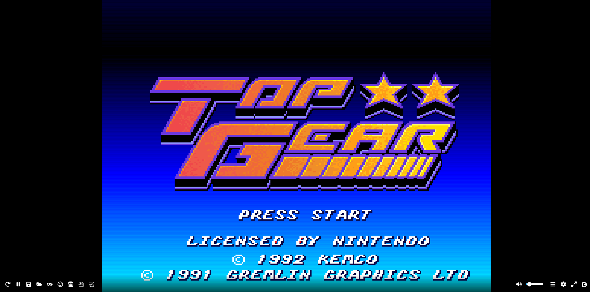

# 🎮 Gesture-browser-app 
## Servidor Web de EmulatorJS con Python y Docker + Control por Gestos con MediaPipe

Este proyecto configura un servidor web ligero que aloja EmulatorJS para jugar en el navegador y utiliza visión por computadora con MediaPipe para controlar el juego mediante gestos de la mano.

## 🚀 Características

- Imagen ligera basada en `python:3.14-rc-alpine`.
- Descarga automática y extracción de EmulatorJS.
- Servidor HTTP simple en el puerto `8080`, accesible desde el navegador.
- Control de juegos con gestos de la mano gracias a OpenCV, MediaPipe y `pyautogui`.

## 🎮 Control por gestos

Puedes controlar el juego usando movimientos de tu mano frente a la cámara:

- ✊ Puño → Presiona la tecla **A**.
- ✊ + ☝️ Índice → Presiona **A** y **Z** (una sola vez).
- 👉 Mano a la izquierda → Mantiene presionada la tecla de flecha **izquierda**.
- 👉 Mano a la derecha → Mantiene presionada la tecla de flecha **derecha**.
- 🙌 Mano centrada → Detiene cualquier movimiento.

Este control se logra con una aplicación Python que usa tu cámara web y simula teclas para interactuar con el emulador.

## 🛠️ Estructura del Proyecto

```
📁 gesture-browser-app/
├── roms/
├── Dockerfile
├── docker-compose.yaml
├── index.html
├── control_gestos.py
└── README.md
```

## 🐳 Uso con Docker Compose

### 1. Clona el repositorio

```bash
git clone https://github.com/Cristianguerrer/gesture-browser-app.git
cd gesture-browser-app
```

### 2. Ejecuta el servidor web

```bash
docker-compose up --build
```

Este comando construirá la imagen, descargará EmulatorJS y expondrá el servidor en [http://localhost:80](http://localhost:80).

### 3. Ejecuta el control por gestos (fuera del contenedor)

Instala las dependencias en tu sistema host (Linux o Windows con Python):

```bash
pip install opencv-python mediapipe pyautogui keyboard
```

Luego ejecuta:

```bash
python control_gestos.py
```

## 🧱 Contenido del Dockerfile

```Dockerfile
FROM python:3.14-rc-alpine

WORKDIR /game

RUN apk add --no-cache curl p7zip && \
    curl -L -o emulatorjs.7z https://github.com/EmulatorJS/EmulatorJS/releases/download/v4.2.1/4.2.1.7z && \
    7z x emulatorjs.7z && \
    rm emulatorjs.7z

COPY index.html .

EXPOSE 8080

CMD ["python", "-m", "http.server", "8080"]
```

## 🧩 docker-compose.yml

```yaml
version: '3.0'

services:
  snes9x:
    build: .
    container_name: snes9x
    ports:
      - "80:8080"
    volumes:
      - ./roms/juego-top-gear.smc:/game/juego-top-gear.smc
```

## 🧪 Verifica que funciona

Abre tu navegador y visita:

```
http://localhost:80
```

Deberías ver EmulatorJS cargando el juego ROM. Usa tu cámara para controlarlo por gestos.


## 📜 Licencia

Este proyecto se distribuye bajo la licencia [MIT](LICENSE).
